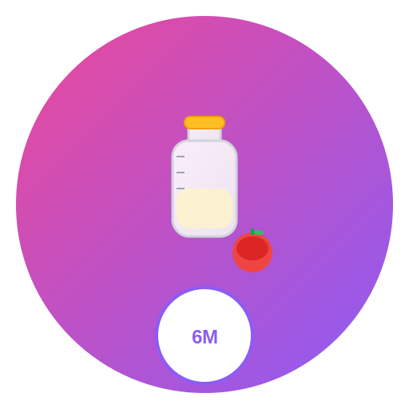

# 🍼 Baby Food Tracker - Anime Edition

<div align="center">



Um aplicativo completo para acompanhar a alimentação do bebê, com uma interface inspirada em anime kawaii.

</div>

## ✨ Funcionalidades

- 🍎 **Rastreamento de alimentos**: Registre quais alimentos foram testados
- 🧪 **Testes de alergia**: Acompanhe os resultados de testes de alergia
- 💊 **Gerenciamento de suplementos**: Controle os suplementos administrados
- 📆 **Cronograma alimentar**: Planeje a introdução de novos alimentos
- 📊 **Estatísticas e progresso**: Visualize o progresso alimentar
- 📱 **PWA**: Funciona offline como um aplicativo nativo
- 🌙 **Tema claro/escuro**: Interface adaptável
- 🔒 **Autenticação**: Login seguro com Supabase

## 🎨 Design Anime Kawaii

Este Baby Food Tracker foi transformado com um sistema de design kawaii inspirado em anime:

### Características de Design

- 🌸 **Paleta de cores pastel suave** com cores kawaii personalizadas (rosa, lavanda, menta, pêssego, céu)
- 🎭 **Efeitos de sombreamento cel** em cards e componentes
- 👶 **Avatar mascote chibi** com animações de corações flutuantes
- ✨ **Animações suaves com Framer Motion** com entradas escalonadas
- 🎪 **Elementos visuais kawaii** incluindo gradientes e cantos arredondados

### Stack de Fontes

- **Fonte de Exibição**: Nico Moji (para títulos e cabeçalhos)
- **Fonte de Corpo**: Nunito Sans (para conteúdo e texto da UI)

### Paleta de Cores

```css
kawaii-pink: #ffd3e1
kawaii-lavender: #e1d7ff
kawaii-mint: #d3ffe4
kawaii-peach: #ffe4d3
kawaii-sky: #d3f4ff
kawaii-cream: #fff9d3
```

## 🚀 Tecnologias

- [React 19](https://react.dev/)
- [Vite](https://vitejs.dev/)
- [TypeScript](https://www.typescriptlang.org/)
- [Tailwind CSS](https://tailwindcss.com/)
- [Shadcn/ui](https://ui.shadcn.com/)
- [Zustand](https://zustand-demo.pmnd.rs/)
- [React Router](https://reactrouter.com/)
- [Supabase](https://supabase.com/) para autenticação e banco de dados

## 🚀 Começando

### Pré-requisitos

- Node.js 18+
- npm

### Instalação

1. Clone o repositório

```bash
git clone https://github.com/1bertogit/baby-food-tracker-anime.git
cd baby-food-tracker-anime
```

2. Instale as dependências

```bash
npm install --legacy-peer-deps
```

3. Inicie o servidor de desenvolvimento

```bash
npm run dev
```

## 📦 Estrutura do Projeto

```
src/
├── assets/               # Arquivos estáticos
├── components/           # Componentes React
│   ├── auth/             # Componentes de autenticação
│   ├── baby-food/        # Componentes específicos do app
│   ├── layout/           # Componentes de layout
│   └── ui/               # Componentes UI (Shadcn)
├── hooks/                # Custom React Hooks
├── lib/                  # Utilitários e helpers
├── pages/                # Páginas da aplicação
├── store/                # Gerenciamento de estado (Zustand)
├── main.tsx              # Ponto de entrada principal
└── app.tsx               # Configuração de rotas e providers
```

## 🌐 Integração com Supabase

Este projeto utiliza o Supabase para:

- Autenticação de usuários
- Banco de dados PostgreSQL
- Row Level Security para proteção de dados
- Armazenamento de arquivos (opcional)

Para configurar o Supabase:

1. Crie uma conta em [supabase.com](https://supabase.com)
2. Configure as variáveis de ambiente:
   - `VITE_SUPABASE_URL`
   - `VITE_SUPABASE_ANON_KEY`

## 📄 Licença

Este projeto está licenciado sob a Licença MIT. Consulte o arquivo [LICENSE](LICENSE) para detalhes.

---

<div align="center">

Feito com ❤️ para todos os pais e bebês

</div>
